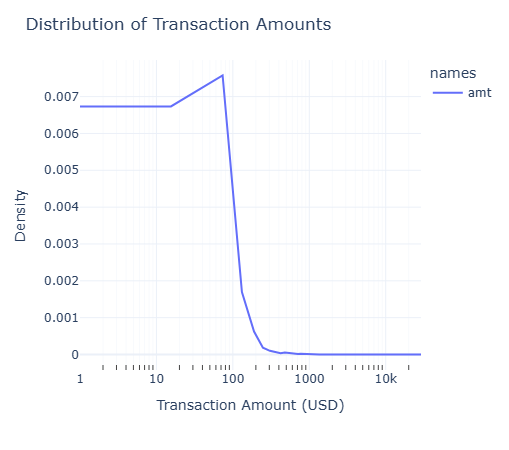
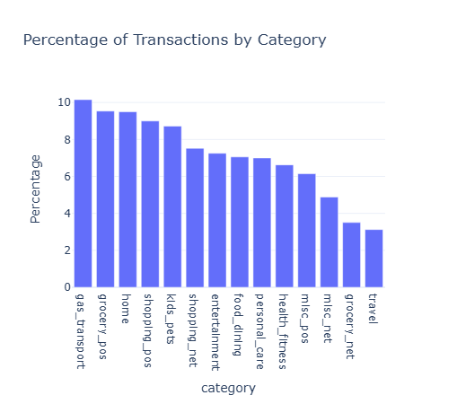
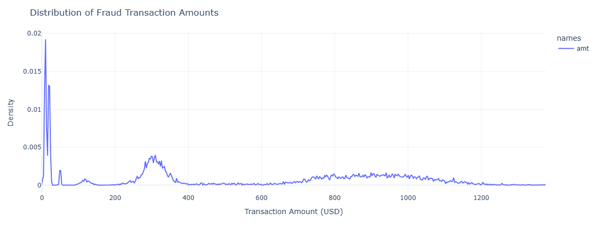
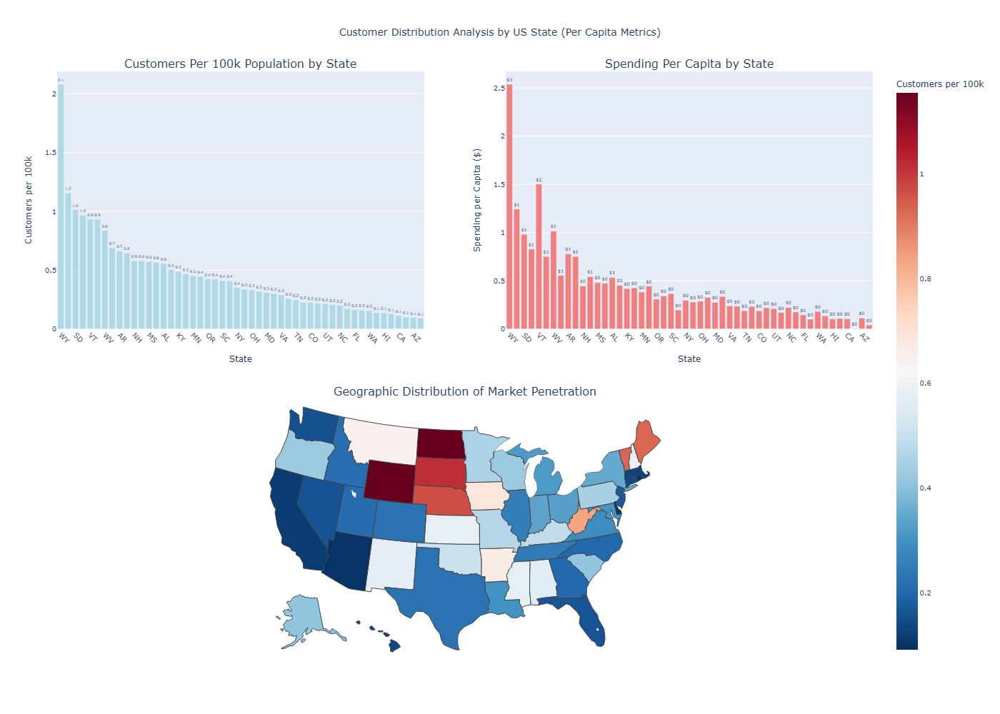

# PayNet Data Analysis Project

This repository contains a Jupyter Notebook (`analysis.ipynb`) that performs data cleaning, PII (Personally Identifiable Information) handling, and exploratory data analysis on a transaction dataset using PySpark.
Environment Setup

The code in `analysis.ipynb` was developed and executed on Ubuntu via WSL (Windows Subsystem for Linux), using Python 3.12.

## Installation Process

To set up your environment and run the notebook, follow these steps:

1. Clone the repository:

```
git clone https://github.com/tniveej/paynet_test.git
cd paynet_test
```

2. Create virtual environment (recommended):

```
conda create -n paynet python=3.12
conda activate paynet
```
- Python 3.12 required for pyspark 4.0 which contains native plotting for sql dataframe (without needing to convert to pandas on spark dataframes)


3. Install required packages:

```
pip install -r requirements.txt
```

4. Run the notebook:
```
jupyter notebook analysis.ipynb
```
5. Other dependencies :

- Ensure jdk version 21 is installed on the system

## Data Cleaning and PII Handling

The dataset is loaded from a JSON file using PySpark. The cleaning process involves several steps to ensure data quality and usability:

1. Cleaning JSON Strings:

    The personal_detail column contains JSON strings that might have extra backslashes and quotes around the JSON objects, making them invalid for direct parsing.

    ```python 
    def clean_json_string(json_str):
        if json_str is None:
            return None
        cleaned = json_str.replace("\\", "")
        cleaned = re.sub(r'"\s*\{\s*(.*?)\s*\}\s*"', r'{\1}', cleaned)
        return cleaned

    clean_json_udf = sf.udf(clean_json_string, StringType())
    df = df.withColumn("personal_detail", clean_json_udf(sf.col("personal_detail")))
    ```

- **Logic**: A User-Defined Function (UDF) `clean_json_string` is applied to the personal_detail column. This UDF removes all backslashes and then uses a regular expression to remove outer quotes from JSON objects within the string, making them parsable.

2. **Schema Definition and Parsing**:
    After cleaning the JSON strings, a schema is defined for the personal_detail column, including a nested schema for address. This allows PySpark to correctly parse the semi-structured JSON data into structured columns.

3. **Name Splitting**:

    The name of the person is split into `first` and `last` names. Robust regular expressions are used to clean up common data entry issues (e.g., extra spaces, non-alphanumeric characters, specific trailing strings).

    ```python
    df_with_names = df_with_parsed_personal.withColumn(
    "cleaned_person_name",
    sf.when(sf.col("personal_detail.person_name").isNotNull(),
        sf.trim(
            sf.regexp_replace(
                sf.regexp_replace(
                    sf.regexp_replace(sf.col("personal_detail.person_name"), r"(?i),?eeeee$", ""),
                    r"(?i),?\s*N[0O]{4,}$", ""
                ),
                r"[^a-zA-Z0-9\s]", " "
            ),
            r"\s+", " "
        )
    ).otherwise(None)
    )
    df_with_names = df_with_names \
        .withColumn("name_parts", sf.split(sf.col("cleaned_person_name"), " ")) \
        .withColumn("first", sf.when(sf.size(sf.col("name_parts")) >= 1, sf.trim(sf.element_at(sf.col("name_parts"), 1))).otherwise(None)) \
        .withColumn("last", sf.when(sf.size(sf.col("name_parts")) > 1, sf.trim(sf.concat_ws(" ", sf.slice(sf.col("name_parts"), 2, sf.size(sf.col("name_parts")))))).otherwise(None)) \
        .drop("cleaned_person_name", "name_parts")
        ```
- **Logic** : 
    
    A new column `cleaned_person_name` is created by applying multiple `regexp_replace` operations to normalize the name string. Then, `sf.split is` used to break the cleaned name into parts, and `sf.element_at` and `sf.concat_ws` are used to extract first and last names, respectively.

4. **Flattening the DataFrame**:

    Nested columns from personal_detail and address are flattened into top-level columns for easier access and analysis.

5. **Type Conversion and Timezone handling**: 

    Columns are cast tother appropriate types. Date/time are handled by assuming all recorded date is UTC and is converted to UTC+8. The different timestamps had difference characteristics that required special handling.

6. **Null Value and "NA" String Handling**:

    String columns are checked for "NA", "null" (case-insensitive), or empty strings, and these values are replaced with actual `None` (null) values.

7. **Merchant Name Cleaning**:

    A specific cleanup step is applied to the merchant column to remove the "fraud_" prefix.

## PII handling 

1. Direct identifier deletion: 

    Columns that directly identify individuals or are highly specific but not required for analysis are dropped: 

    ```python
    identifier_delete = [
    "cc_num",
    "first",
    "last",
    "trans_num",
    "cc_bic",
    "street",
    ]
    df_cleaned = df_cleaned.drop(*identifier_delete)
    ```
2. Reducing specificity of Location Data: 

    Latitude and longitude, while not direct identifiers on their own, can become highly specific when combined. Their precision (rounding to two decimal places) is reduced to generalize location.

    ```python
    df_cleaned = df_cleaned.withColumn("lat", sf.round(sf.col("lat"), 2))
    df_cleaned = df_cleaned.withColumn("long", sf.round(sf.col("long"), 2))
    ```

3. Reducing Specificity of Birth Date:

    The birth date is reduced to the year, as it is not required for analysis.

4. Creating unique identifier without PII:

    To count unique customers without using PII, a composite identifier is created from non-sensitive attributes.

    ```python
    df_cleaned_with_person_id = df_cleaned.withColumn(
        "unique_person_identifier",
        sf.concat_ws(
            "_",
            sf.coalesce(sf.col("job"), sf.lit("NULL_JOB")),
            sf.coalesce(sf.col("gender"), sf.lit("NULL_GENDER")),
            sf.coalesce(sf.col("zip"), sf.lit("NULL_ZIP"))
        )
    )
    ```
## Data Analysis

1. Distribution of Transaction Amounts (KDE Plot):

    A kernel density estimate (KDE) plot is created to show the distribution of transaction amounts. This plot provides insights into the frequency and distribution of different transaction amounts.
    
    <div align="center">
        
    </div>

    **Findings**:
    - Most transactions are small with a peak at $73.
    - There are a few very large transactions but the smaller ones should remain the focus of analysis.


2. Percentage of Transactions by Category (Bar Chart):

    A bar chart is created to show the percentage of transactions by category. This chart provides insights into the distribution of transactions across different categories.

    <div align="center">
        
    </div>

    **Findings**:
    - The majority of transactions are in 'gas_transport' category with around 10.15% of all sales. However, most of the transactions are fairly evenly distributed across categories.
    - Therefore, future focus on product imrpovement could be to play to the strengths and provide added value in the 'gas_transport' category.
    - Sales can also be focused on boosting the lower performing categories such as travel (3.12%) by improving product offerings.


3. Distribution of Fraud Transaction Amounts (KDE Plot):

    KDE plot is created to show the distribution of fraudulent transaction amounts. It provides insights into the frequency and distribution of fraudulent transactions.

    <div align="center">
        
    </div>

    **Findings**:
    - Most fraudulent transactions are small..
    - However there is a prevalence in fraud cases at around 300$ that can come in useful to identify the types of fraudulent transactions.

    Other bar charts plot out the specific demographics of fraudulent transactions

    <div align="center">
        
    </div>

    **Findings**:
    - grocery and online shopping are the most common types of fraudulent transactions.
    - New Yors, Texas and Pennsylvania are the most common states for fraudulent transactions.
    - Fraudulent transactions are mostly even across jobs and merchants. 


4. Custom Distribution Analysis by US State (Per Capita Metrics):

    This visualization combines three plots:

    - A bar chart showing "Customers Per 100k Population by State".

    - A bar chart showing "Spending Per Capita by State".

    - A choropleth map showing "Geographic Distribution of Market Penetration".

    The logic involves:

    - Loading US state population data from [Kaggle](https://www.kaggle.com/datasets/alexandrepetit881234/us-population-by-state) .

    - Creating a unique_person_identifier from non-PII fields (job, gender, zip) to count distinct customers per state.

    - Aggregating customer counts, total transactions, average transaction amounts, and total spending by state.

    - Joining this aggregated data with the state population data.

    - Calculating "customers per 100k", "transactions per 100k", and "spending per capita" by dividing by the state population.

    - The data is then converted to a Pandas DataFrame for plotting with Plotly's make_subplots to create the combined visualization. The choropleth map zmax is adjusted to exclude extreme outliers (like Wyoming) for better visual distribution.

        <div align="center">
            
        </div>

    **Findings:**

    - Customer Penetration: States like Wyoming, North Dakota, and South Dakota show the highest customer penetration per 100k population, indicating strong market presence relative to their population size.

    - Spending Habits: Wyoming also leads in spending per capita, suggesting that customers in these highly penetrated states not only exist in higher proportions but also spend more on average.

    - Geographic Distribution: The choropleth map visually confirms these patterns, highlighting regions with higher (darker red/blue) and lower (lighter shades) market penetration.

    - Underserved Markets: The analysis identifies large population states (e.g., California, Florida, Texas) with relatively low customer penetration per capita. These states represent significant market expansion opportunities if their customer penetration can be brought up to the median level. For instance, California alone has a potential for 91 additional customers if it reaches the median penetration.

        > More detailed analysis can be found in the file

## Interactive Map overlaying the heatmap of the transactions

This section creates an interactive geographical heatmap using folium as a showcase of the folium and dash APIs. This allows for customized dashboards with a large number of informative plots to be shown directly in a web browser or jupyter notebook with html and css design.

View plot in the notebook or click [here](./assets/folium_heatmap.html)

## Final thoughts and additional analysis

This project demonstarats my ability to clean, prepare and display data in a meaningful way using python. The following are some additional data analytics that can be carried out with a more detailed analysis:

**Potential additional analysis:** 

1. Time-series analysis.

- Analyze transaction trends over time (daily, weekly, monthly) to identify seasonality, growth patterns, or unusual spikes.
- Investigate the temporal distribution of fraudulent transactions to see if they occur more frequently during specific periods.

2. Fraud detection modelling.

- Develop machine learning models (e.g., Logistic Regression, Random Forest, Isolation Forest) to predict is_fraud based on transaction characteristics.

- Feature engineering from existing columns (e.g., transaction frequency per customer/merchant, average transaction amount per category, time between transactions).

3. Customer Segmentation study.

- Cluster customers based on their transaction behavior (e.g., categories they spend in, average transaction amount, frequency) to identify different customer segments.

- Analyze spending patterns across different demographic groups (gender, age group from dob).

4. Merchant Analysis. 

- Identify top merchants for added benefits. 
- Analyze merchant categories and their correlation with fraud.

5. Geospatial clustering.

- More than just the heatmap: Perform density-based clustering (e.g., DBSCAN) on lat/long to identify high-density transaction areas or potential fraud hotspots.

6. Expenditure type by age group. 

- Find the spending habits of various age groups and tailor products better to them. 

